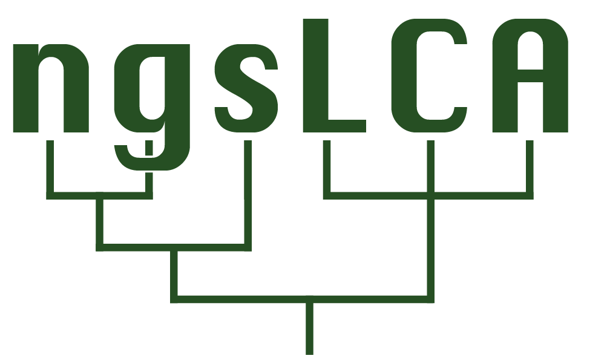

<!--
```{image} ngsLCA_Logo.png
:alt: logo
:class: bg-primary
:width: 2000px
:align: center
``` -->

[](https://github.com/miwipe/ngsLCA/actions/workflows/build-tests.yml) 


This is the official development repository for ngsLCA (next generation sequence Lowest Common Ancestor algorithm). The toolkit includes two modules, ngsLCA main program and ngsLCA R package. The ngsLCA main program provides a fast and flexible taxonomic classification of DNA reads aligned to reference databases containing multiple organisms. The classification builds upon the NCBI taxonomy and performs a naïve lowest common ancestor assignment for reads with multiple alignments against different references. It is a command line tool that outputs a text file in "lca" format.

The ngsLCA R package provides functionality for processing "lca" files and illustrating the taxonomic profiles. It supplies R functions for quick transformation of the "lca" files to tables in different formats after filtering, e.g., a regular tab separated table and MEGAN compatible formats, for de-contamination if laboratory controls have been sequenced and are provided, and for splitting taxa into different kingdoms (or user-defined taxonomic groups) and taxonomic ranks. Functions are also provided for outputting heatmaps, barplots and stratplots as well as NMDS and rarefaction analysis for a quick overview of the dataset.

**Please note, that if you are working with ancient environmental DNA (shotgun sequenced or capture enriched data) you might want to use (metaDMG-cpp)[https://github.com/metaDMG-dev/metaDMG-cpp] this tool uses ngsLCA while at the same time able to estimate DNA damage at all taxonomic levels). Both of these tools jhave been developed as part of the Holi pipeline (Holi)[https://github.com/miwipe/Holi/tree/main]** 

# Installation
We encourage that you manage your packages and environments using conda (https://docs.conda.io/en/latest/) 

## Installation using conda
Download the environment file and create the conda environment, this will install ngsLCA, fastp, sga, bowtie2, samtools and their dependencies. All necessary for trimming, removing low complexity reads, deduplication mapping and sorting files for the taxonomic assigment using ngsLCA. 

```
wget https://raw.githubusercontent.com/miwipe/ngsLCA/master/environment.yaml
conda env create -f environment.yaml 
conda activate ngsLCA 
```

# Build ngsLCA from development version by cloning the github repo
ngsLCA main program requires [HTSlib](https://github.com/samtools/htslib) which is a common library used for handling high-throughput sequencing data. You can install it as shown below or link to a previously-installed HTSlib when running make on ngsLCA.

```
git clone --recursive https://github.com/SAMtools/htslib
git clone https://github.com/miwipe/ngsLCA
cd htslib
make
cd ../ngsLCA
make HTSSRC=../htslib
```

Released version of ngsLCA R package can be installed from [CRAN](https://CRAN.R-project.org) with:

``` r
install.packages("ngsLCA")
```

or from [github](https://github.com/wyc661217/ngsLCA) with:

``` r
remotes::install_github("wyc661217/ngsLCA")
```

# Reference genomic database
The toolkit is built upon the [NCBI taxonomy](https://www.ncbi.nlm.nih.gov/taxonomy) therefore requires the reference database(s) complying to the NCBI format, i.e., fasta header should contain accession ID as the first string that appears in the [NCBI access2taxID file](https://ftp.ncbi.nlm.nih.gov/pub/taxonomy/accession2taxid/nucl_gb.accession2taxid.gz), and the corresponded taxaID is present in NCBI taxonomy dmp files. This can be the NCBI-nt, or any divisions of NCBI-RefSeq. For custom reference genomes not covered by NCBI, their accession IDs and the corresponded NCBI taxonomic IDs need to be manually attached to the NCBI access2taxID file before running the ngsLCA main program.


# Test dataset
For a quick test of whether the installation of ngsLCA was successful, input alignments files in bam format can be found here https://sid.erda.dk/sharelink/AqTXI6E560. If you want to generate alignment files using your own data (in bam/sam/sam.gz) please follow this quick guide:

1. Download raw sequencing data, example fastq-files can be found in the fastq folder (It is assumed that all fastq-files have been demultiplexed, trimmed and quality controlled). 

2. Download a database of your own choice. Here we use NCBI-RefSeq plastid database. We build the refence data into bowtie2 indexed format here and later will use bowtie2 as the aligner. Although bowtie2 achieves fast alignment on large genomic database, it will only record the first N hits (set by the -k option) on each read into the generated BAM file, which are not guaranteed to be the best possible alignments. Other aligners such as BWA and MALT can also be used for generating BAM files for ngsLCA.

```
mkdir refseq_plastids;
cd refseq_plastids;
wget ftp://ftp.ncbi.nlm.nih.gov/refseq/release/plastid/*genomic.fna.gz;
gzip -d *;
cat *.fna > plastids.fa;
rm *.fna;
bowtie2-build --threads 5 plastids.fa plastids 
```


3. Align your quality checked reads (refer to this [repository](https://github.com/miwipe/ngsLCA/tree/master/quality_filtering) for suggested qulity controls before alignment) against the database, an example:
```
bowtie2 --threads 10 -k 1000 -x refseq_plastids/plastids -U file_name.fq --no-unal  | samtools view -bS - > file_name.plastids.bam
```

4. If more than one database has been used as reference, all resulting bam files need to be merged and sorted. This is important as ngsLCA assumes that all unique readIDs are aligned next to each other, an example:

```
samtools merge -@ 10 -n file_name.merged.bam file_name.*.bam
samtools sort -@ 10 -m 2G -n -T /TMP_folder/ -O bam -o file_name.merged.sorted.bam file_name.merged.bam
```

# Running ngsLCA main program
## Downloading resource files from NCBI 
```
mkdir ncbi_tax_dmp;
cd ncbi_tax_dmp/;
wget https://ftp.ncbi.nlm.nih.gov/pub/taxonomy/new_taxdump/new_taxdump.zip;
unzip new_taxdump.zip;
wget https://ftp.ncbi.nlm.nih.gov/pub/taxonomy/accession2taxid/nucl_gb.accession2taxid.gz
```

## Running ngsLCA main program
The ngsLCA main program considers a chosen similarity interval between each read and its reference in the generated bam/sam file. It has been tested downloading the nt, refseq as well as individual genomes and fasta sequences. The similarity can be set as an edit distance [-editdist[min/max]], i.e., number of mismatches between the read to reference genome, or as a similarity distance [-simscore[low/high]], i.e., percentage of mismatches between the read to reference genome. Edit distance can be a number between 0-10, while the similarity score is a number between 0-1.

Example for running the ngsLCA main program with 0 edit distances to reference:
```
ngsLCA/ngsLCA -editdistmin 0 -editdistmax 0 -fix_ncbi 0 -names ncbi_tax_dmp/names.dmp.gz -nodes ncbi_tax_dmp/nodes.dmp.gz -acc2tax ncbi_tax_dmp/nucl_gb.accession2taxid.gz -bam file_name.merged.sorted.bam -outnames outfile.ed0
```

Example for running the ngsLCA main program with an interval of edit distances (min 0, max 5) to reference. In this case the algorithm will perform an LCA on all alignments of a given read that have between 0 and 5 mismatches. It will not discriminate between better or worse alignments within the defined interval.
```
ngsLCA/ngsLCA -editdistmin 0 -editdistmax 5 -fix_ncbi 0 -names ncbi_tax_dmp/names.dmp -nodes ncbi_tax_dmp/nodes.dmp -acc2tax ncbi_tax_dmp/nucl_gb.accession2taxid.gz -bam file_name.merged.sorted.bam -outnames outfile
```

If the editditmin is set to 2, the algorithm will only parse reads with the best alignment of 2 or more mismatches and not parse reads that have better alignments. This allows for a stepwise examination of the taxonomic profiles generated by allowing gradually more mismatches.
```
ngsLCA/ngsLCA -editdistmin 2 -names ncbi_tax_dmp/names.dmp -nodes ncbi_tax_dmp/nodes.dmp -acc2tax ncbi_tax_dmp/nucl_gb.accession2taxid.gz -bam file_name.merged.sorted.bam -outnames outfile.ed2
```

The similarity score function works in the same way as for the edit distance, with the exception that the similarity to the reference is now calculated as a percentage and hence takes the length of the read into account. Example for running the ngsLCA main program with similarity scores (95-100% similarity) [-simscore[low/high]] 0.95-1.0:
```
ngsLCA/ngsLCA -simscorelow 0.95 -simscorehigh 1.0 -fix_ncbi 0 -names ncbi_tax_dmp/names.dmp -nodes ncbi_tax_dmp/nodes.dmp -acc2tax ncbi_tax_dmp/nucl_gb.accession2taxid.gz -bam file_name.merged.sorted.bam  -outnames outfile.ss095to1
```

## Full explanation of options

| Parameter                 | Description   |	
| :------------------------ | :-------------|
|-bam           | filename for input bam file
|-editdistmin   | minimum editdistance allowed
|-editdistmax   | maximum editdistance allowed
|-simscorelow   | minimum editdistance allowed, as proportion
|-simscoremax   | maximum editdistance allowed, as proportion
|-names         | filename for [NCBI taxdump names.dmp](https://ftp.ncbi.nih.gov/pub/taxonomy/new_taxdump/)
|-nodes         | filename for [NCBI taxdump nodes.dmp](https://ftp.ncbi.nih.gov/pub/taxonomy/new_taxdump/)
|-acc2tax       | filename for [NCBI nucl_gb.accession2taxid](https://ftp.ncbi.nih.gov/pub/taxonomy/accession2taxid/)
|-outnames      | prefix for the output filenames generated
|-minmapq       | minimum mapping quality allowed
|-discard       | discard reads with a flag value, default 512
|-fix_ncbi      | fixes ncbi taxonomy naming issue, default 0

## The output file (.lca) format
The resulting file (.lca) from the ngsLCA main program is a flat text file in which each line contains a unique read that has been assigned to its LCA with the specified similarity.

The file is tab separated. The first column contains the read metadata which is colon separated, including read ID (colon separated column 1-7), the query sequence (8), length of the sequence (9), and number of hits to the reference (10). The second column contains the LCA assigned to that read, separated by colon is the 'NCBI taxaID':'taxon name':'taxonomic level'. Following columns contain the full taxonomic path higher in the NCBI taxonomy for the LCA.


# Running ngsLCA R package
## Example workflow
Running ngsLCA R package requires all lca files to be processed being placed in a folder as input, with each input lca file normally representing a sample. The following example workflow will run through all ngsLCA R functions. The output files and results in this example will be generated into “Desktop/project_files/lca_files/run03”. Detailed descriptions into the funtion and parameters for each R function can be found in its help page within R.

Define work directory and name of the run:

``` r
library(ngsLCA)
working_directory="Desktop/project_files/lca_files/" #change it to the path of your lca files folder.
run_name="run03"
```

Generate a complete taxa profile by combining all input lca files (this step is required for running all other functions). It will generate a tab separated text file (“complete_profile.txt”) into the folder named after “run_name” in the working directory, in which the first 3 columns are NCBI taxaID, taxaname, and taxa rank. Each of the following columns shows the reads abundance of an input .lca file. You can type `?ngsLCA_profile` to enter the help page for ngsLCA_profile to access an example sample metadata file.

``` r
ngsLCA_profile(path=working_directory,
               run=run_name,
               metadata="Desktop/project_files/sample_metadata.txt") #change it to the full path of your sample metadata.
```

Filter the combined taxa profile. This will filter the complete_profile.txt.

``` r
ngsLCA_filter(path=working_directory,
              run=run_name,
              remove.taxa="1115501,10114", #taxa ID indicate taxa that will be removed from the results.
              threshold.1=2,
              threshold.2=0,
              threshold.3=5)
```

De-contaminate the combined taxa profile. This will generate a contanimation list based on the negetive controls. This will generate a contamination list based on the negative controls. The list taxa will be subtracted from the complete_profile.txt.

``` r
ngsLCA_deContam(path=working_directory,
                run=run_name,
                control_path="Desktop/project_files/blank_control_lca_files/", #change it to the full path of your blank control lca files folder.
                threshold.1_control=2,
                threshold.2_control=0,
                threshold.3_control=5)
```

Group taxa in complete_profile.txt into user-defined taxa groups.

``` r
ngsLCA_group(path=working_directory,
             run=run_name,
             group.name="Viruses,Archaea,Bacteria,Fungi,Viridiplantae,Metazoa",
             threshold.perGroup=0)
```

Classify taxa in complete_profile.txt to taxonomic ranks. 

``` r
ngsLCA_rank(path=working_directory,
            run=run_name,
            rank.name="species,genus,family")
```

Count reads and taxa numbers. This will generate statistics for the reads and taxa numbers for all above filters, groups, and classifications. Example are shown in the following example Figure a and b.

``` r
ngsLCA_count(path=working_directory,
             run=run_name)
```

Generate files that can be inputted into Megan for taxa profiling.

``` r
ngsLCA_meganFile(path=working_directory,
                 run=run_name)
```

Generate taxa abundance heatmaps. An example is shown in the following example Figure d.

``` r
ngsLCA_heatmap(path=working_directory,
               run=run_name,
               taxa.number=20)
```

Generate taxa abundance barplots. An example is shown in the following example Figure c.

``` r
ngsLCA_barplot(path=working_directory,
               run=run_name,
               taxa.number=20)
```

Generate taxa abundance stratplots. An example is shown in the following example Figure e.

``` r
ngsLCA_stratplot(path=working_directory,
                 run=run_name,
                 taxa.number=10)
```

Perform rarefaction on taxa reads abundance. An example is shown in the following example Figure f.

``` r
ngsLCA_rarefy(path=working_directory,
              run=run_name)
```

Perform taxa profiles NMDS. An example is shown in the following example Figure g.

``` r
ngsLCA_NMDS(path=working_directory,
            run=run_name,
            dimension=2,
            trymax=10)
```


## Example output illustrations

